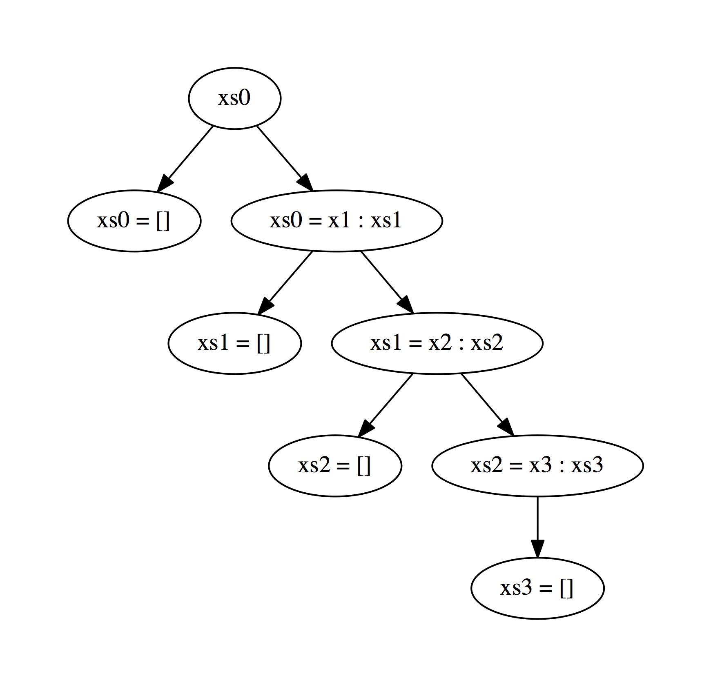

% Automated Specification-Based Testing
% Eric Seidel
% eseidel@cs.ucsd.edu

\newcommand{\lnode}[3]{\mathrm{Node\ {#1}\ {#2}\ {#3}}}
\newcommand{\lleaf}{\mathrm{Leaf}}
\newcommand{\ltup}[2]{\mathrm{({#1},{#2})}}
\newcommand{\lcons}[2]{\mathrm{{#1}:{#2}}}
\newcommand{\lnil}{\mathrm{[]}}
\newcommand{\imp}{\Rightarrow}
\newcommand{\xor}{\oplus}
\newcommand{\defeq}{\ \doteq\ }
\newcommand{\wedge}{\ \land\ }

\newcommand\val[1]{\sigma(x)}
\newcommand\cvar[1]{\mathrm{{#1}}}
\newcommand\clen[1]{\cstr{len}\ {#1}}
\newcommand\cstr[1]{\mathsf{{#1}}}
\newcommand\ttrue{\cstr{true}}
\newcommand\tfalse{\cstr{false}}

\newcommand\meta[1]{[\![#1]\!]}
\newcommand\reft[3]{\{{#1}:{#2}\ |\ {#3}\}}

# A Binary Search Tree Library

```haskell
data Tree
  = Leaf
  | Node Int Tree Tree
```

```haskell
insert :: Int -> Tree -> Tree
delete :: Int -> Tree -> Tree
```

. . .

> Did I get it "right"?

# Testing

Two key questions to answer when testing:

1. How to **provide** inputs?
2. How to **check** outputs?

<!-- # Outline -->

<!-- 1. **Human-generated tests** -->
<!-- 2. Machine-enumerated inputs -->
<!-- 3. Dynamic-Symbolic Execution -->
<!-- 4. Type-targeted testing -->

# Standard Practice: Unit-Testing

Programmer specifies inputs *and* outputs

. . .

```haskell
assertEquals (insert 1 Leaf) (Node 1 Leaf Leaf)

assertEquals (insert 1 (Node 2 Leaf Leaf)) (Node 1 Leaf (Node 2 Leaf Leaf))
```

. . .

A lot of effort to produce a "complete" test-suite!

<!-- But this is tiresome... -->

<!-- . . . -->

<!-- > hope that these tests generalize! -->

# This Talk: Techniques for Automatic Unit-Testing

<!-- 1. Human-generated tests -->
- Existing Techniques
1. **Black-box testing**
2. White-box testing
- Our contribution
3. Type-targeted testing

# Black-box testing

- Given a **specification** of expected behavior, but no knowledge of internals
- Generate many inputs and validate against spec

. . .

1. How to **provide** inputs?
    - Machine enumerates based on **specification**
2. How to **check** outputs?
    - Programmer supplies **oracle**

<!-- . . . -->

<!-- 1 is harder, start with 2 -->

<!-- - Machine enumerates many inputs -->
<!-- - Programmer specifies oracle to check outputs -->

<!-- . . . -->

<!-- MOVE THIS LATER, SHOW iSBST -->
<!-- ```haskell -->
<!-- prop_insert_elem x t = x `elem` insert x t -->
<!-- prop_insert_bst  x t = isBST (insert x t) -->
<!-- ``` -->

# Checking Outputs with Oracles

```haskell
isBST t = case t of
  Leaf -> True
  Node y l r -> abs (height l - height r) <= 1
             && all (< y) l && all (> y) r
             && isBST l     && isBST r
```

`isBST` **checks** whether a tree satisfies the balancing and ordering invariants

# Providing Inputs by Enumeration

**Small-scope hypothesis**: if a counterexample exists, a "small" counterexample probably exists too

- TestEra (2001), Korat (2004), SmallCheck (2008)

# SmallCheck

<!-- ```haskell -->
<!-- data Tree -->
<!--   = Leaf -->
<!--   | Node Int Tree Tree -->

<!-- instance Serial Tree where -->
<!--   series = cons0 Leaf \/ cons3 Node -->
<!-- ``` -->

<!-- . . . -->

<!-- ENUMERAUTE ALL SMALL INPUTS -->

Given a **property**, SmallCheck enumerates all inputs (up to some depth) and runs the property

<!-- WHAT ARE INPUTS AND OUTPUTS -->
. . .

```haskell
prop_insert_bst :: Int -> Tree -> Bool
prop_insert_bst x t = isBST (insert x t)
```

`prop_insert_bst` states that `insert` should return a **valid** tree

. . .

<!-- HOW TO RUN IT -->
```haskell
ghci> smallCheck 3 prop_insert_bst
```

Test all integers in range `[-3,3]` and all trees of depth 3

. . .

<!-- WHAT IS OUTPUT -->
```haskell
Failed test no. 4.
there exist 0, Node 0 Leaf (Node 0 Leaf Leaf) such that
  condition is false
```

4th test produces **invalid** tree as output

. . .

Property does not hold for **all** trees!

# SmallCheck: Adding Preconditions

Given a **property**, SmallCheck enumerates all inputs (up to some depth) and runs the property

```haskell
prop_insert_bst :: Int -> Tree -> Bool
prop_insert_bst x t = isBST t ==> isBST (insert x t)
```

**If** the input tree is valid, **then** the output tree should be valid

<!-- HOW TO RUN IT -->
```haskell
ghci> smallCheck 3 prop_insert_bst
```

Test all integers in range `[-3,3]` and all trees of depth 3

. . .

```haskell
Completed 567 tests without failure.
But 434 did not meet ==> condition.
```

Only 133 input trees were valid!

# SmallCheck: How small?

Given a **property**, SmallCheck enumerates all inputs (up to some depth) and runs the property

```haskell
prop_insert_bst :: Int -> Tree -> Bool
prop_insert_bst x t = isBST t ==> isBST (insert x t)
```

**If** the input tree is valid, **then** the output tree should be valid

<!-- HOW TO RUN IT -->
```haskell
ghci> smallCheck 4 prop_insert_bst
```

Test all integers in range `[-4,4]` and all trees of depth 4

<!-- # SmallCheck: How small? -->

. . .

```haskell
..........................................................
```

. . .

Exponential blowup in input space confines search to *very small* inputs!

<!-- (Again, custom generators are a standard solution to increase feasible search depth) -->

. . .

- Heuristics to prune "equivalent" inputs (Lazy SmallCheck, Korat)
- Can be brittle in practice
    <!-- - but must be careful how you structure precondition -->
    <!-- - e.g. should binary-search tree check ordering or balancing first? -->

<!-- POP BACK TO BLACK-BOX, STRIKEOUT ALL, REPLACE WITH RANDOM -->

# Black-box testing

<!-- - Given a *specification* of expected behavior -->
<!--     - but no knowledge of internals -->
<!-- - Generate many inputs and validate against spec -->

<!-- . . . -->

1. How to **provide** inputs?
    - Machine **randomly** enumerates based on **specification**
2. How to **check** outputs?
    - Programmer supplies **oracle**

# Providing Inputs by Random Enumeration

- Sample random inputs from **entire domain**
- Enables checking larger inputs
- No guarantee of minimal counterexample
- QuickCheck (2000), JCrasher (2004), Randoop (2007)

<!-- # QuickCheck -->

<!-- - provides DSL for writing random value generators -->

<!-- <\!-- ```haskell -\-> -->
<!-- <\!-- instance Arbitrary Tree where -\-> -->
<!-- <\!--   arbitrary = oneof [ leaf, node ] -\-> -->
<!-- <\!--     where -\-> -->
<!-- <\!--     leaf = return Leaf -\-> -->
<!-- <\!--     node = do x <- arbitrary -\-> -->
<!-- <\!--               l <- arbitrary -\-> -->
<!-- <\!--               r <- arbitrary -\-> -->
<!-- <\!--               return (Node x l r) -\-> -->
<!-- <\!-- ``` -\-> -->

<!-- - properties specified as with SmallCheck -->

# QuickCheck

Given a property, QuickCheck enumerates **random** inputs and runs the property

```haskell
prop_insert_bst x t
  = isBST t ==> isBST (insert x t)
```

If the input tree is valid, then the output tree should be valid

. . .

```haskell
ghci> quickCheck prop_insert_bst
```

Test `prop_insert_bst` on 100 random, **valid** inputs

. . .

```haskell
+++ OK, passed 100 tests.
```

How is this possible? SmallCheck showed that input domain is *very* sparse!

# QuickCheck: With Statistics

Given a property, QuickCheck enumerates **random** inputs and runs the property

```haskell
prop_insert_bst x t
  = isBST t ==> isBST (insert x t)
```

If the input tree is valid, then the output tree should be valid

```haskell
ghci> quickCheck prop_insert_bst
```

Test `prop_insert_bst` on 100 random, valid inputs, while collecting statistics about inputs

<!-- # QuickCheck: Testing `insert` -->

<!-- ```haskell -->
<!-- prop_insert_bst x t -->
<!--   = isBST t ==> collect (size t) (isBST (insert x t)) -->
<!-- ``` -->

. . .

```haskell
+++ OK, passed 100 tests:
73% 0
21% 1
 6% 2
```

73% of the trees were **empty** and 21% had only one element

# QuickCheck: With Non-Trivial Inputs

Given a property, QuickCheck enumerates **random** inputs and runs the property

```haskell
prop_insert_bst x t
  = isBST t && size t > 1 ==> isBST (insert x t)
```

If the input tree is valid **and** contains more than one element, then the output tree should be valid

```haskell
ghci> quickCheck prop_insert_bst
```

Test `prop_insert_bst` on 100 random, valid inputs

. . .

```haskell
*** Gave up! Passed only 37 tests.
```

Less than 1/10 generated trees were valid

. . .

Input domain is too sparse, QuickCheck cannot generate trees with more than 2 elements!

# QuickCheck: Custom Generators

```haskell
newtype BST = Tree

instance Arbitrary BST where
  arbitrary = ...

prop_insert_bst x (BST xs)
  = isBST (insert x xs)
```

. . .

**Problem**

1. How to generate random **valid** trees?
2. Are we sampling from uniform distribution?
3. Must define a new type/generator for **each** precondition!

# Black-box testing

<!-- - Given a *specification* of expected behavior -->
<!--     - but no knowledge of internals -->
<!-- - Generate many inputs and validate against spec -->

<!-- . . . -->

1. How to **provide** inputs?
    - Machine (randomly) enumerates based on **specification**
2. How to **check** outputs?
    - Programmer supplies **oracle**

. . .

## Problems

- Brute-force enumeration of inputs suffers from input explosion
<!-- - Random generation enables testing larger inputs -->
<!-- - Sampling from a **uniform** distribution provides better case for generalizing outcome -->
- Random enumeration requires custom generators for preconditions

# This Talk: Techniques for Automatic Unit-Testing

<!-- 1. Human-generated tests -->
- Existing Techniques
1. Black-box testing
2. **White-box testing**
- Our contribution
3. Type-targeted testing

# White-Box Testing

- Given program **implementation**, make it **crash**
- Enumerating program paths instead of inputs
- **Symbolic execution** groups equivalent inputs
<!-- - aim for 100% coverage as quickly as possible -->

<!-- # Dynamic-Symbolic Testing -->

<!-- - introduced by Godefroid et al and Cadar et al in 2005 -->

<!-- - combines symbolic execution to enumerate code paths with concrete execution to trigger bugs -->

<!-- - search for inputs that make the program crash -->

# White-Box Testing Via Symbolic Execution

- Originally envisioned as static-analysis technique
- Program memory $M$ maps variables to symbolic expressions
- Construct **path condition** $P$ describing constraints to trigger current path

```haskell
f x y
  = let z = y + 1
    in if z > 0
       then assert (z!=0)
       else True
```

# White-Box Testing Via Symbolic Execution

- Originally envisioned as static-analysis technique
- Program memory $M$ maps variables to symbolic expressions
- Construct **path condition** $P$ describing constraints to trigger current path

```haskell
f x y                     -- 0
  = let z = y + 1
    in if z > 0
       then assert (z!=0)
       else True
```

$M_0 = \{x \mapsto \alpha_1, y \mapsto \alpha_2\}$

$P_0 = \langle \rangle$

# White-Box Testing Via Symbolic Execution

- Originally envisioned as static-analysis technique
- Program memory $M$ maps variables to symbolic expressions
- Construct **path condition** $P$ describing constraints to trigger current path

```haskell
f x y                     -- 0
  = let z = y + 1         -- 1
    in if z > 0
       then assert (z!=0)
       else True
```

$M_1 = \{x \mapsto \alpha_1, y \mapsto \alpha_2, z \mapsto (\alpha_2 + 1)\}$

$P_1 = \langle \rangle$

# White-Box Testing Via Symbolic Execution

- Originally envisioned as static-analysis technique
- Program memory $M$ maps variables to symbolic expressions
- Construct **path condition** $P$ describing constraints to trigger current path

```haskell
f x y                     -- 0
  = let z = y + 1         -- 1
    in if z > 0           -- 2
       then assert (z!=0)
       else True
```

$M_2 = \{x \mapsto \alpha_1, y \mapsto \alpha_2, z \mapsto (\alpha_2 + 1)\}$

$P_2 = \langle \rangle$

# White-Box Testing Via Symbolic Execution

- Originally envisioned as static-analysis technique
- Program memory $M$ maps variables to symbolic expressions
- Construct **path condition** $P$ describing constraints to trigger current path

```haskell
f x y                     -- 0
  = let z = y + 1         -- 1
    in if z > 0           -- 2
       then assert (z!=0) -- 3
       else True
```

$M_3 = \{x \mapsto \alpha_1, y \mapsto \alpha_2, z \mapsto (\alpha_2 + 1)\}$

$P_3 = \langle z > 0 \rangle$

. . .

**Implicit** branch condition `z==0` would trigger assertion failure

. . .

Check satisfiability of:&nbsp;&nbsp;&nbsp;&nbsp;&nbsp;&nbsp;$M_3 \land P_3 \land z = 0$

# White-Box Testing Via Symbolic Execution

- Originally envisioned as static-analysis technique
- Program memory $M$ maps variables to symbolic expressions
- Construct **path condition** $P$ describing constraints to trigger current path

```haskell
f x y                     -- 0
  = let z = y + 1         -- 1
    in if z > 0           -- 2
       then assert (z!=0) -- 3
       else True
```

$M_3 = \{x \mapsto \alpha_1, y \mapsto \alpha_2, z \mapsto (\alpha_2 + 1)\}$

$P_3 = \langle z > 0 \rangle$

**Implicit** branch condition `z==0` would trigger assertion failure

Check satisfiability of:&nbsp;&nbsp;&nbsp;&nbsp;&nbsp;&nbsp;$M_3 \land P_3 \land z = 0$&nbsp;&nbsp;&nbsp;&nbsp;&nbsp;&nbsp;**UNSAT**

. . .

Assertion cannot fail!

# The Problem With Symbolic Execution

1. Relies on constraint solver to reason about path feasibility
    - Many programs are difficult to express in solver's logic
   <!--  - non-linear arithmetic -->
   <!--  - floating-point numbers -->
   <!--  - pointer arithmetic -->
2. Path-explosion on real-world programs

# Dynamic-Symbolic Execution

- Combine symbolic and concrete execution
- Fall back on **concrete** value when symbolic execution fails
- DART (2005), CUTE (2006), EXE (2006), PEX (2008), KLEE (2008)

# Dynamic-Symbolic Execution

- Combine symbolic and concrete execution
- Fall back on **concrete** value when symbolic execution fails
- DART (2005), CUTE (2006), EXE (2006), PEX (2008), KLEE (2008)

. . .

- Start with random inputs, e.g. $\{x = 1, t = \cstr{Node}\ 2\ \cstr{Leaf}\ \cstr{Leaf}\}$

```haskell
insert x t = case t of
  Leaf       -> singleton x
  Node y l r
    | x <  y -> bal y (insert x l) r
    | x >  y -> bal y l (insert x r)
    | x == y -> t
```

> - At `LT` branch, we have $P_{LT} = \langle t = \cstr{Node}\ y\ l\ r, x < y \rangle$
> - Choose new path by negating path condition and solving for new inputs, e.g. $t = \cstr{Node}\ y\ l\ r \land \lnot (x < y)$
> - Many more sophisticated search techniques have been explored

# Dynamic-Symbolic Execution: Specifications

`insert` will never crash on its own, need to check specification

```haskell
prop_insert_bst x t =
  if isBST t
  then assert (isBST (insert x t))
  else True
```

. . .

**Problem**: paths must pass through `isBST` before reaching `insert`!

<!-- # Dynamic-Symbolic Execution: Preconditions -->

```haskell
isBST t = case t of
  Leaf -> True
  Node y l r -> abs (height l - height r) <= 1
             && all (< y) l && all (> y) r
             && isBST l     && isBST r
```

# Dynamic-Symbolic Execution: Preconditions

```haskell
isBST t = case t of
  Leaf -> True
  Node y l r ->
    | not (abs (height l - height r) <= 1) -> False
    | not (all (< y) l)                    -> False
    | not (all (> y) r)                    -> False
    | not (isBST l)                        -> False
    | not (isBST r)                        -> False
    | otherwise                            -> True
```

. . .

- 5 possible paths for *invalid* node, only 1 for *valid* node
- Compounds as execution unfolds recursive datatype

. . .

> Solver enumerates paths through **precondition** instead of function

# White-Box Testing

- Given program **implementation**, make it **crash**
- Enumerating program paths instead of inputs
- **Symbolic execution** groups equivalent inputs

. . .

## Problems

- Symbolic execution suffers from inexpressive logics and path explosion
- Dynamic-symbolic execution only addresses first issue
- Path explosion particularly problematic when faced with recursive preconditions

# This Talk: Techniques for Automatic Unit-Testing

<!-- 1. Human-generated tests -->
- Existing Techniques
1. Black-box testing
2. White-box testing
- Our contribution
3. **Type-targeted testing**

# What We Want

<!-- > Write a single generator per type, that can generate values satisfying different predicates. -->

Systematically generate **valid inputs** that are **guaranteed** to pass the precondition

. . .

1. How to **provide** inputs?
2. How to **check** outputs?

<!-- # Type-Targeted Testing -->
. . .

Use **refinement types** as unified specification mechanism for input-generation and output-checking

# Refinement Types

## `{v:t | p}`

> The set of values `v` of type `t` satisfying a predicate `p`

# Refinement Types

## `{v:t | p}`

> The set of values `v` of type `t` satisfying a predicate `p`

### Simple Refinement Types

```haskell
type Nat   = {v:Int | v >= 0}
type Pos   = {v:Int | v >  0}
type Rng N = {v:Int | v >= 0 && v < N}
```

The natural numbers, positive integers, and integers in the range $[0,N)$

# Refinement Types

## `{v:t | p}`

> The set of values `v` of type `t` satisfying a predicate `p`

### Simple Refinement Types

```haskell
type Nat   = {v:Int | v >= 0}
type Pos   = {v:Int | v >  0}
type Rng N = {v:Int | v >= 0 && v < N}
```

The natural numbers, positive integers, and integers in the range $[0,N)$

### Compound Refinement Types

Describe properties of containers and function contracts by refining component types

<!-- ```haskell -->
<!-- [{v:Int | v /= 0}] -->
<!-- ``` -->

<!-- Lists that contain no zeros -->

```haskell
x:Nat -> {v:Nat | v = x + 1}
```
Functions that take a natural number and increment it by one

# Refinement Types: Applications

- Traditionally used for program verification
- We show that refinement types can also be viewed as exhaustive test-suite

. . .

## Enables gradual verification
1. Write high-level spec as refinement type
2. Immediate gratification from comprehensive test-suite
3. Once design has settled, add hints / inductive invariants to allow verification

# Target
Generates tests from refinement types via query-decode-check loop

1. Translate input types into SMT **query**
2. **Decode** SMT model into concrete values
3. Run function and **check** that result inhabits output type

. . .

- Exhaustively checks all inputs up to a given depth-bound
- Like SmallCheck with a smarter generator

# Primitive Types: Query

```haskell
rescale :: r1:Nat -> r2:Nat -> s:Rng r1 -> Rng r2
rescale r1 r2 s = s * (r2 `div` r1)
```

. . .

Embed primitive constraints directly in logic

$\cstr{C_0} \defeq 0 \leq \cvar{r_1} \wedge 0 \leq \cvar{r_2} \wedge 0 \leq s < \cvar{r_1}$

# Primitive Types: Decode

```haskell
rescale :: r1:Nat -> r2:Nat -> s:Rng r1 -> Rng r2
rescale r1 r2 s = s * (r2 `div` r1)
```

Embed primitive constraints directly in logic

$\cstr{C_0} \defeq 0 \leq \cvar{r_1} \wedge 0 \leq \cvar{r_2} \wedge 0 \leq s < \cvar{r_1}$

A model $[\cvar{r_1} \mapsto 1, \cvar{r_2} \mapsto 1, \cvar{s} \mapsto 0]$
maps to a concrete test case

```haskell
rescale 1 1 0
```

# Primitive Types: Check

```haskell
rescale :: r1:Nat -> r2:Nat -> s:Rng r1 -> Rng r2
rescale r1 r2 s = s * (r2 `div` r1)
```

Embed primitive constraints directly in logic

$\cstr{C_0} \defeq 0 \leq \cvar{r_1} \wedge 0 \leq \cvar{r_2} \wedge 0 \leq s < \cvar{r_1}$

A model $[\cvar{r_1} \mapsto 1, \cvar{r_2} \mapsto 1, \cvar{s} \mapsto 0]$
maps to a concrete test case

```haskell
rescale 1 1 0 == 0
```

> - Postcondition is:&nbsp;&nbsp;&nbsp;&nbsp;&nbsp;&nbsp;&nbsp;&nbsp;`{v:Int | v >= 0 && v < r2}`
> - After substitution:&nbsp;&nbsp;&nbsp;&nbsp;&nbsp;&nbsp;$0 \geq 0 \wedge 0 < 1$

# Primitive Types: Check

```haskell
rescale :: r1:Nat -> r2:Nat -> s:Rng r1 -> Rng r2
rescale r1 r2 s = s * (r2 `div` r1)
```

Embed primitive constraints directly in logic

$\cstr{C_0} \defeq 0 \leq \cvar{r_1} \wedge 0 \leq \cvar{r_2} \wedge 0 \leq s < \cvar{r_1}$

A model $[\cvar{r_1} \mapsto 1, \cvar{r_2} \mapsto 1, \cvar{s} \mapsto 0]$
maps to a concrete test case

```haskell
rescale 1 1 0 == 0
```

- Postcondition is:&nbsp;&nbsp;&nbsp;&nbsp;&nbsp;&nbsp;&nbsp;&nbsp;`{v:Int | v >= 0 && v < r2}`
- After substitution:&nbsp;&nbsp;&nbsp;&nbsp;&nbsp;&nbsp;$0 \geq 0 \wedge 0 < 1$&nbsp;&nbsp;&nbsp;&nbsp;&nbsp;&nbsp;**VALID**

. . .

Request another model by **refuting** previous with

$\cstr{C_1} \defeq \cstr{C_0} \wedge \lnot (\cvar{r_1} = 1 \land \cvar{r_2} = 1 \land \cvar{s} = 0)$

# Primitive Types: Next model

```haskell
rescale :: r1:Nat -> r2:Nat -> s:Rng r1 -> Rng r2
rescale r1 r2 s = s * (r2 `div` r1)
```

Embed primitive constraints directly in logic

$\cstr{C_0} \defeq 0 \leq \cvar{r_1} \wedge 0 \leq \cvar{r_2} \wedge 0 \leq s < \cvar{r_1}$

$\cstr{C_1} \defeq \cstr{C_0} \wedge \lnot (\cvar{r_1} = 1 \land \cvar{r_2} = 1 \land \cvar{s} = 0)$

A model $[\cvar{r_1} \mapsto 1, \cvar{r_2} \mapsto 0, \cvar{s} \mapsto 0]$
maps to a concrete test case

```haskell
rescale 1 0 0 == 0
```

. . .

After subsitution:&nbsp;&nbsp;&nbsp;&nbsp;&nbsp;&nbsp;$0 \geq 0 \wedge 0 < 0$

# Primitive Types: Next model

```haskell
rescale :: r1:Nat -> r2:Nat -> s:Rng r1 -> Rng r2
rescale r1 r2 s = s * (r2 `div` r1)
```

Embed primitive constraints directly in logic

$\cstr{C_0} \defeq 0 \leq \cvar{r_1} \wedge 0 \leq \cvar{r_2} \wedge 0 \leq s < \cvar{r_1}$

$\cstr{C_1} \defeq \cstr{C_0} \wedge \lnot (\cvar{r_1} = 1 \land \cvar{r_2} = 1 \land \cvar{s} = 0)$

A model $[\cvar{r_1} \mapsto 1, \cvar{r_2} \mapsto 0, \cvar{s} \mapsto 0]$
maps to a concrete test case

```haskell
rescale 1 0 0 == 0
```

After subsitution:&nbsp;&nbsp;&nbsp;&nbsp;&nbsp;&nbsp;$0 \geq 0 \wedge 0 < 0$&nbsp;&nbsp;&nbsp;&nbsp;&nbsp;&nbsp;**INVALID**

`rescale 1 0 0` is a counterexample!

<!-- ```haskell -->
<!-- rescale :: r1:Pos -> r2:Pos -> s:Rng r1 -> Rng r2 -->
<!-- rescale r1 r2 s = s * (r2 `div` r1) -->
<!-- ``` -->

# Containers

```haskell
type Weight = Pos
type Score  = Rng 100
average :: [(Weight, Score)] -> Score
```

How to encode structured data in SMT formula?

# Containers: Query

Generate a **single** set of constraints describing **all possible** inputs.



Let solver choose path through skeleton.

# Containers: Choice Variables

```haskell
type Weight = Pos
type Score  = Rng 100
average :: [(Weight, Score)] -> Score
```

How to encode structured data in SMT formula?

$(\cvar{c}_{00} \Rightarrow \cvar{xs}_0 = \lnil) \wedge (\cvar{c}_{01} \Rightarrow \cvar{xs}_0 = \lcons{\cvar{x}_1}{\cvar{xs}_1})$

Choice variables $\cvar{c}$ **guard** other constraints

. . .

Force solver to choose one with $\cvar{c}_{00} \oplus \cvar{c}_{01}$


# Containers: Encoding Lists of Depth 3

<!-- $\begin{aligned} -->
<!-- \cstr{C_{list}} & \defeq & (\cvar{c}_{i0} \Rightarrow \cvar{xs}_i = \lnil) \wedge -->
<!--                            (\cvar{c}_{i1} \Rightarrow \cvar{xs}_i = \lcons{\cvar{x}_{i+1}}{\cvar{xs}_{i+1}})\\ -->
<!--                 & \wedge & (\cvar{c}_{i1} \Rightarrow \cvar{c}_{(i+1)0} \oplus \cvar{c}_{(i+1)1})\\ -->
<!-- \end{aligned}$ -->
$\begin{aligned}
\cstr{C_{list}} & \defeq & (\cvar{c}_{00} \Rightarrow \cvar{xs}_0 = \lnil) & \wedge &
                           (\cvar{c}_{01} \Rightarrow \cvar{xs}_0 = \lcons{\cvar{x}_1}{\cvar{xs}_1}) & \wedge &
                           & & (\cvar{c}_{00} & \oplus & \cvar{c}_{01}) \\
                & \wedge & (\cvar{c}_{10} \Rightarrow \cvar{xs}_1 = \lnil) & \wedge &
                           (\cvar{c}_{11} \Rightarrow \cvar{xs}_1 = \lcons{\cvar{x}_2}{\cvar{xs}_2}) & \wedge &
                           (\cvar{c}_{01} & \Rightarrow & \cvar{c}_{10} & \oplus & \cvar{c}_{11}) \\
                & \wedge & (\cvar{c}_{20} \Rightarrow \cvar{xs}_2 = \lnil) & \wedge &
                           (\cvar{c}_{21} \Rightarrow \cvar{xs}_2 = \lcons{\cvar{x}_3}{\cvar{xs}_3}) & \wedge &
                           (\cvar{c}_{11} & \Rightarrow & \cvar{c}_{20} & \oplus & \cvar{c}_{21}) \\
                & \wedge & (\cvar{c}_{30} \Rightarrow \cvar{xs}_3 = \lnil) & & & \wedge &
                           (\cvar{c}_{21} & \Rightarrow & \cvar{c}_{30}) & &
\end{aligned}$

$\cstr{C_{list}}$ encodes the **structure** of all lists with at most 3 elements.

# Containers: Encoding Lists of Depth 3

<!-- $\begin{aligned} -->
<!-- \cstr{C_{list}} & \defeq & (\cvar{c}_{i0} \Rightarrow \cvar{xs}_i = \lnil) \wedge -->
<!--                            (\cvar{c}_{i1} \Rightarrow \cvar{xs}_i = \lcons{\cvar{x}_{i+1}}{\cvar{xs}_{i+1}})\\ -->
<!--                 & \wedge & (\cvar{c}_{i1} \Rightarrow \cvar{c}_{(i+1)0} \oplus \cvar{c}_{(i+1)1})\\ -->
<!-- \end{aligned}$ -->
$\begin{aligned}
\cstr{C_{list}} & \defeq & (\cvar{c}_{00} \Rightarrow \cvar{xs}_0 = \lnil) & \wedge &
                           (\cvar{c}_{01} \Rightarrow \cvar{xs}_0 = \lcons{\cvar{x}_1}{\cvar{xs}_1}) & \wedge &
                           & & (\cvar{c}_{00} & \oplus & \cvar{c}_{01}) \\
                & \wedge & (\cvar{c}_{10} \Rightarrow \cvar{xs}_1 = \lnil) & \wedge &
                           (\cvar{c}_{11} \Rightarrow \cvar{xs}_1 = \lcons{\cvar{x}_2}{\cvar{xs}_2}) & \wedge &
                           (\cvar{c}_{01} & \Rightarrow & \cvar{c}_{10} & \oplus & \cvar{c}_{11}) \\
                & \wedge & (\cvar{c}_{20} \Rightarrow \cvar{xs}_2 = \lnil) & \wedge &
                           (\cvar{c}_{21} \Rightarrow \cvar{xs}_2 = \lcons{\cvar{x}_3}{\cvar{xs}_3}) & \wedge &
                           (\cvar{c}_{11} & \Rightarrow & \cvar{c}_{20} & \oplus & \cvar{c}_{21}) \\
                & \wedge & (\cvar{c}_{30} \Rightarrow \cvar{xs}_3 = \lnil) & & & \wedge &
                           (\cvar{c}_{21} & \Rightarrow & \cvar{c}_{30}) & &
\end{aligned}$

$\cstr{C_{list}}$ encodes the **structure** of all lists with at most 3 elements.

<!-- $\cstr{C_{data}} \defeq \cvar{c}_{i1} \Rightarrow \cvar{x}_{i+1} = \ltup{\cvar{w}_{i+1}}{\cvar{s}_{i+1}} \ \wedge\ 0 < \cvar{w}_{i+1} \ \wedge\ 0 \leq \cvar{s}_{i+1} < 100$ -->
$\begin{aligned}
\cstr{C_{data}} & \defeq & (\cvar{c}_{01} \Rightarrow \cvar{x}_1 = \ltup{\cvar{w}_1}{\cvar{s}_1} \ \wedge\ 0 < \cvar{w}_1 \ \wedge\ 0 \leq \cvar{s}_1 < 100) \\
                & \wedge & (\cvar{c}_{11} \Rightarrow \cvar{x}_2 = \ltup{\cvar{w}_2}{\cvar{s}_2} \ \wedge\ 0 < \cvar{w}_2 \ \wedge\ 0 \leq \cvar{s}_2 < 100) \\
                & \wedge & (\cvar{c}_{21} \Rightarrow \cvar{x}_3 = \ltup{\cvar{w}_3}{\cvar{s}_3} \ \wedge\ 0 < \cvar{w}_3 \ \wedge\ 0 \leq \cvar{s}_3 < 100)
\end{aligned}$

$\cstr{C_{data}}$ encodes the constraints on the **elements** of $\cstr{C_{list}}$.

# Containers: Decode

To build a list from a model

$[ \cvar{c_{00}} \mapsto\ \tfalse,\ \cvar{c_{01}} \mapsto\ \ttrue,\ \cvar{w_1} \mapsto
1,\ \cvar{s_1} \mapsto 2,\ \cvar{c_{10}} \mapsto\ \ttrue, \ldots\ ]$

. . .

follow the choice variables!

$\cvar{c_{i0}} \mapsto \ttrue \imp \cvar{xs_i} = \lnil\ \land\ \cvar{c_{i1}} \mapsto \ttrue \imp \cvar{xs_i} = \lcons{x_{i+1}}{xs_{i+1}}$

Realized value:&nbsp;&nbsp;&nbsp;&nbsp;&nbsp;&nbsp;`[(1,2)]`

# Containers: Refuting

To build a list from a model

$[ \cvar{c_{00}} \mapsto\ \tfalse,\ \cvar{c_{01}} \mapsto\ \ttrue,\ \cvar{w_1} \mapsto
1,\ \cvar{s_1} \mapsto 2,\ \cvar{c_{10}} \mapsto\ \ttrue, \ldots\ ]$

follow the choice variables!

$\cvar{c_{i0}} \mapsto \ttrue \imp \cvar{xs_i} = \lnil\ \land\ \cvar{c_{i1}} \mapsto \ttrue \imp \cvar{xs_i} = \lcons{x_{i+1}}{xs_{i+1}}$

Realized value:&nbsp;&nbsp;&nbsp;&nbsp;&nbsp;&nbsp;`[(1,2)]`

**Only** refute constraints that contribute to **realized** value

. . .

$[ \cvar{c_{00}} \mapsto\ \tfalse,\ \cvar{c_{01}} \mapsto\ \ttrue,\ \cvar{w_1} \mapsto
1,\ \cvar{s_1} \mapsto 2,\ \cvar{c_{10}} \mapsto\ \ttrue, \ldots\ ]$

is refuted by

$\lnot (\cvar{c_{00}} = \tfalse \land \cvar{c_{01}} = \ttrue \land \cvar{w_1} = 1 \land \cvar{s_1} = 2 \land \cvar{c_{10}} = \ttrue)$

# Ordered Containers

```haskell
insert :: a -> Sorted a -> Sorted a
```

```haskell
data Sorted a = []
              | (:) { h :: a, t :: Sorted {v:a | h < v} }
```

Recursive refinement relates the `head` with **each** element of the `tail`.

# Ordered Containers: Query

```haskell
insert :: a -> Sorted a -> Sorted a
```

```haskell
data Sorted a = []
              | (:) { h :: a, t :: Sorted {v:a | h < v} }
```

Recursive refinement relates the `head` with **each** element of the `tail`.

Instantiate recursive refinement each time we unfold `(:)`

> - Level 2:&nbsp;&nbsp;&nbsp;&nbsp;&nbsp;&nbsp;`x1 < x2`
> - Level 3:&nbsp;&nbsp;&nbsp;&nbsp;&nbsp;&nbsp;`x1 < x3 && x2 < x3`

. . .

$\begin{aligned}
\cstr{C_{ord}}   & \defeq & (\cvar{c}_{11} \Rightarrow \cvar{x}_1 < \cvar{x}_2)
                   \wedge   (\cvar{c}_{21} \Rightarrow \cvar{x}_1 < \cvar{x}_3\ \wedge\ \cvar{x}_2 < \cvar{x}_3)
\end{aligned}$

# Ordered Containers: Guards

```haskell
insert :: a -> Sorted a -> Sorted a
```

```haskell
data Sorted a = []
              | (:) { h :: a, t :: Sorted {v:a | h < v} }
```

Recursive refinement relates the `head` with **each** element of the `tail`.

Instantiate recursive refinement each time we unfold `(:)`

- Level 2:&nbsp;&nbsp;&nbsp;&nbsp;&nbsp;&nbsp;`x1 < x2`
- Level 3:&nbsp;&nbsp;&nbsp;&nbsp;&nbsp;&nbsp;`x1 < x3 && x2 < x3`

$\begin{aligned}
\cstr{C_{ord'}}   & \defeq & (\cvar{x}_1 < \cvar{x}_2)
                    \wedge   (\cvar{x}_1 < \cvar{x}_3\ \wedge\ \cvar{x}_2 < \cvar{x}_3)
\end{aligned}$

. . .

Forces $\cvar{x}_1 < \cvar{x}_2 < \cvar{x}_3$ **regardless** of which are in the realized model!

. . .

Prohibits generation of valid inputs, e.g. `[2,3]`

# Structured Containers

```haskell
best :: k:Nat -> {v:[Score] | k <= len v} -> {v:[Score] | k = len v}
```

`best` takes a `Nat` and a list of **at least** `k` scores, and returns a list with **exactly** `k` scores.

. . .

```haskell
measure len :: [a] -> Nat
len []      = 0
len (x:xs)  = 1 + len xs
```

`len` is a **logical function** that describes the length of a list.

<!-- best k xs = take k $ reverse $ sort xs -->

# Structured Containers: Query

```haskell
best :: k:Nat -> {v:[Score] | k <= len v} -> {v:[Score] | k = len v}
```

`best` takes a `Nat` and a list of **at least** `k` scores, and returns a list with **exactly** `k` scores.

```haskell
measure len :: [a] -> Nat
len []      = 0
len (x:xs)  = 1 + len xs
```

`len` is a **logical function** that describes the length of a list.

Instantiate measure definition each time we unfold `[]` or `(:)`

$\begin{aligned}
\cstr{C_{size}} & \defeq & (\cvar{c}_{00} \Rightarrow \clen{\cvar{xs}_{0}} = 0) & \wedge &
                           (\cvar{c}_{01} \Rightarrow \clen{\cvar{xs}_{0}} = 1 + \clen{\cvar{xs}_1}) \\
                & \wedge & (\cvar{c}_{10} \Rightarrow \clen{\cvar{xs}_{1}} = 0) & \wedge &
                           (\cvar{c}_{11} \Rightarrow \clen{\cvar{xs}_{1}} = 1 + \clen{\cvar{xs}_2}) \\
                & \wedge & (\cvar{c}_{20} \Rightarrow \clen{\cvar{xs}_{2}} = 0) & \wedge &
                           (\cvar{c}_{21} \Rightarrow \clen{\cvar{xs}_{2}} = 1 + \clen{\cvar{xs}_3}) \\
                & \wedge & (\cvar{c}_{30} \Rightarrow \clen{\cvar{xs}_{3}} = 0) &        &
\end{aligned}$

. . .

Enforce relation between `k` and `xs` by adding constraint $k \leq \clen{\cvar{xs}_0}$

# Evaluation

- Compared Target against QuickCheck, SmallCheck, Lazy SmallCheck
- Real libraries: `Data.Map`, `RBTree`, `XMonad.StackSet`
- No custom generators
- `Data.Map`: checked balancing and ordering invariants
- `RBTree`: checked red-black and ordering invariants
- `XMonad.StackSet`: checked uniqueness of windows

# Evaluation


# Takeaway
> - Target can explore larger input spaces than (Lazy) SmallCheck
> - QuickCheck requires custom generators for functions with complex preconditions
> - Dynamic-symbolic execution gets stuck on precondition path-explosion
> - Target specs are amenable to future formal verification

# Backup Slides

# Dynamic-Symbolic Testing: Why Concrete + Symbolic?

```c
struct foo { int i; char c; }
bar (struct foo *a) {
  if (a->c == 0) {
    *((char *)a + sizeof(int)) = 1;
    if (a->c != 0)
      abort();
  }
}
```

- Symbolic executors cannot report with **certainty** that `abort` is reachable
<!-- - pointer arithmetic confuses alias analysis -->
- Dynamic-Symbolic testing need only solve `a->c == 0` to produce **concrete** input that will blow up!
<!-- - fill gaps in symbolic reasoning with **concrete** value -->

<!-- # Encoding Trees of Depth 2 -->

<!-- $\begin{aligned} -->
<!-- \cstr{C_{tree}} & \defeq & (\cvar{c}_{t0} \Rightarrow \cvar{t} = \lleaf) & \wedge & -->
<!--                            (\cvar{c}_{t1} \Rightarrow \cvar{t} = \lnode{\cvar{x}_t}{\cvar{l}_t}{\cvar{r}_t}) & \wedge & -->
<!--                            & & (\cvar{c}_{t0} & \oplus & \cvar{c}_{t1}) \\ -->
<!--                 & \wedge & (\cvar{c}_{l_t0} \Rightarrow \cvar{l}_t = \lleaf) & \wedge & -->
<!--                            (\cvar{c}_{l_t1} \Rightarrow \cvar{l}_t = \lnode{\cvar{x}_l}{\cvar{l}_l}{\cvar{r}_l}) & \wedge & -->
<!--                            (\cvar{c}_{t1} & \Rightarrow & \cvar{c}_{l_t0} & \oplus & \cvar{c}_{l_t1}) \\ -->
<!--                 & \wedge & (\cvar{c}_{r_t0} \Rightarrow \cvar{r}_t = \lleaf) & \wedge & -->
<!--                            (\cvar{c}_{r_t1} \Rightarrow \cvar{r}_t = \lnode{\cvar{x}_r}{\cvar{l}_r}{\cvar{r}_r}) & \wedge & -->
<!--                            (\cvar{c}_{t1} & \Rightarrow & \cvar{c}_{r_t0} & \oplus & \cvar{c}_{r_t1}) \\ -->
<!--                 & \wedge & (\cvar{c}_{l_l0} \Rightarrow \cvar{l}_l = \lleaf) &  & -->
<!--                             & \wedge & -->
<!--                            (\cvar{c}_{l_t1} & \Rightarrow & \cvar{c}_{l_l0}) &  & \\ -->
<!--                 & \wedge & (\cvar{c}_{r_l0} \Rightarrow \cvar{r}_l = \lleaf) &  & -->
<!--                             & \wedge & -->
<!--                            (\cvar{c}_{l_t1} & \Rightarrow & \cvar{c}_{r_l0}) &  & \\ -->
<!--                 & \wedge & (\cvar{c}_{l_r0} \Rightarrow \cvar{l}_r = \lleaf) &  & -->
<!--                             & \wedge & -->
<!--                            (\cvar{c}_{r_t1} & \Rightarrow & \cvar{c}_{l_r0}) &  & \\ -->
<!--                 & \wedge & (\cvar{c}_{r_r0} \Rightarrow \cvar{r}_r = \lleaf) &  & -->
<!--                             & \wedge & -->
<!--                            (\cvar{c}_{r_t1} & \Rightarrow & \cvar{c}_{r_r0}) &  & \\ -->
<!-- \end{aligned}$ -->


# NOTES

- [ ] perhaps start with demo
- [ ] intro is abrupt
- [X] monomorphic tree
- [ ] don't show class isntances
- [X] fix smallcheck/quickcheck examples
- [ ] preface symbolic execution better (why?)
- [X] keep rescale def around
- [X] kill questions slide
- [ ] maybe start with `average`
- [ ] more comparisons!!
- [X] un-demorgan refutations
- [X] clarify that we use a single set of constraints to represent all possible inputs
- [X] no sub-bullets or just bold
- [ ] more consistent slide titles
- [ ] explain all code with english
- [ ] RECAP: re-use black-box slides with PROBLEM section


<!-- # Questions -->
<!-- - do we need base types in refinements (i.e. why not assertions?) -->
<!--     - we use base types to implicitly quantify over elements of containers -->
<!--     - avoid recursive assertions, which are difficult to reason about -->
<!-- - is theory of inductive datatypes decidable? -->
<!--     - theory is decidable, but NP-complete -->
<!--     - Arrays: QF is decidable (NP-complete), w/ quals undecidable -->
<!--     - Integers: QF is NP-complete, w/ quals undecidable -->
<!--     - contrast to QF_EUF, which is polynomial -->
<!-- - studies validating small-scope hypothesis? -->
<!--     - 2003 (unpublished) study of java collections framework claims validity -->
