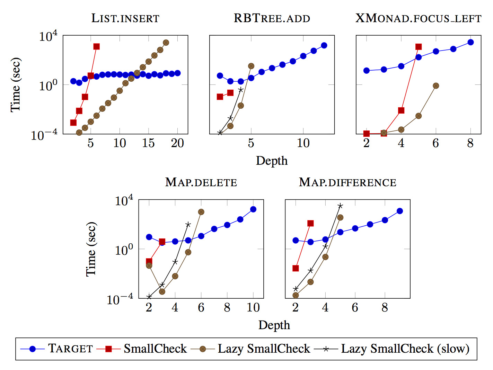

% Automated Specification-Based Testing
% Eric Seidel
% eseidel@cs.ucsd.edu

\newcommand{\ltup}[2]{\mathrm{({#1},{#2})}}
\newcommand{\lcons}[2]{\mathrm{{#1}:{#2}}}
\newcommand{\lnil}{\mathrm{[]}}
\newcommand{\imp}{\Rightarrow}
\newcommand{\xor}{\oplus}
\newcommand{\defeq}{\ \doteq\ }
\newcommand{\wedge}{\ \land\ }

\newcommand\val[1]{\sigma(x)}
\newcommand\cvar[1]{\mathrm{{#1}}}
\newcommand\clen[1]{\cstr{len}\ {#1}}
\newcommand\cstr[1]{\mathsf{{#1}}}
\newcommand\ttrue{\cstr{true}}
\newcommand\tfalse{\cstr{false}}

\newcommand\meta[1]{[\![#1]\!]}
\newcommand\reft[3]{\{{#1}:{#2}\ |\ {#3}\}}

# A Binary Search Tree Library

```haskell
data Tree
  = Leaf
  | Node Int Tree Tree

insert :: Int -> Tree -> Tree
delete :: Int -> Tree -> Tree
```

. . .

> Did I get it "right"?

# Testing

Two key questions to answer when testing:

1. How to **provide** inputs?
2. How to **check** outputs?

# Outline

1. **Human-generated tests**
2. Machine-enumerated inputs
3. Dynamic-Symbolic Execution
4. Type-targeted testing

# Human-generated tests

Programmer specifies inputs *and* outputs

. . .

```haskell
insert 1 Leaf
  == Node 1 Leaf Leaf

insert 1 (Node 2 Leaf Leaf)
  == Node 1 Leaf (Node 2 Leaf Leaf)
```

. . .

But this is tiresome...

. . .

> hope that these tests generalize!

# Outline

1. Human-generated tests
2. **Machine-enumerated inputs**
3. Dynamic-Symbolic Execution
4. Type-targeted testing

# Machine-enumerated inputs

- Machine enumerates many inputs
- Programmer specifies oracle to check outputs

. . .

```haskell
prop_insert_elem x t = x `elem` insert x t
prop_insert_bst  x t = isBST (insert x t)
```

# Enumerate All "Small" Inputs

"Small-scope hypothesis"

> if a counterexample exists, a "small" counterexample probably exists too

- TestEra (2001), Korat (2004), SmallCheck (2008)

# SmallCheck

```haskell
data Tree
  = Leaf
  | Node Int Tree Tree

instance Serial Tree where
  series = cons0 Leaf \/ cons3 Node
```

. . .

```haskell
ghci> smallCheck 3 prop_insert_bst
Failed test no. 4.
there exist 0, Node 0 Leaf (Node 0 Leaf Leaf) such that
  condition is false
```

. . .

`insert` doesn't accept just *any* tree

# Testing `insert`: Preconditions

```haskell
prop_insert_bst x t
  = isBST t ==> isBST (insert x t)
```

. . .

```haskell
ghci> smallCheck 3 prop_insert_bst
Completed 567 tests without failure.
But 434 did not meet ==> condition.
```

# How small?

```haskell
ghci> smallCheck 4 prop_insert_bst
```

# How small?

```haskell
ghci> smallCheck 4 prop_insert_bst
..........................................................
```

. . .

Exponential blowup in input space confines search to *very small* inputs!

<!-- (Again, custom generators are a standard solution to increase feasible search depth) -->

. . .

- Can abuse laziness to filter equivalent inputs (Lazy SmallCheck, Korat)
    - but must be careful how you structure filtering predicate
    - e.g. should binary-search tree check ordering or balancing first?

# Alternative: Randomly Generate Inputs

- random sampling from all possible inputs
    - enables checking larger inputs
    - no guarantee of minimal counterexample
- QuickCheck (2000), JCrasher (2004), Randoop (2007)

# QuickCheck

- provides DSL for writing random value generators

```haskell
instance Arbitrary Tree where
  arbitrary = oneof [ leaf, node ]
    where
    leaf = return Leaf
    node = do x <- arbitrary
              l <- arbitrary
              r <- arbitrary
              return (Node x l r)
```

- properties specified as with SmallCheck

# Testing `insert`: QuickCheck

```haskell
ghci> quickCheck prop_insert_bst
+++ OK, passed 100 tests.
```

. . .

How is this possible? SmallCheck showed that input domain is *very* sparse!

# Testing `insert`: QuickCheck

```haskell
prop_insert_bst x t
  = isBST t ==> collect (size t) (isBST (insert x t))
```

. . .

```haskell
ghci> quickCheck prop_insert_bst
+++ OK, passed 100 tests:
73% 0
21% 1
 6% 2
```

# Testing `insert`: QuickCheck

```haskell
prop_insert_bst_nontrivial x t
  = isBST t && size t > 1 ==> collect (size t) (isBST (insert x t))
```

. . .

```haskell
ghci> quickCheck prop_insert_bst
*** Gave up! Passed only 37 tests (100% 2).
```

. . .

Input domain is too sparse, QuickCheck cannot generate trees with more than 2 elements!

# Testing `insert`: Custom Generators

```haskell
newtype BST = Tree

instance Arbitrary BST where
  arbitrary = ...

prop_insert_bst x (BST xs)
  = isBST (insert x xs)
```

. . .

Must define a new type/generator for *each* precondition!

# Recap

- brute-force enumeration of inputs suffers from input explosion
- random generation enables testing larger inputs
    - sampling from a **uniform** distribution provides better case for generalizing outcome
    - but requires custom generators for preconditions

# Outline

1. Human-generated tests
2. Machine-enumerated inputs
3. **Dynamic-Symbolic Execution**
4. Type-targeted testing

# Dynamic-Symbolic Execution

- Hard-code correctness condition (e.g. don't crash!)
- Machine searches for inputs that violate it
    - avoid input explosion by enumerating program paths (via symbolic execution)
    - aim for 100% coverage as quickly as possible

<!-- # Dynamic-Symbolic Testing -->

<!-- - introduced by Godefroid et al and Cadar et al in 2005 -->

<!-- - combines symbolic execution to enumerate code paths with concrete execution to trigger bugs -->

<!-- - search for inputs that make the program crash -->

# A Primer on Symbolic Execution

- originally envisioned as static-analysis technique
- map variables to symbolic expressions instead of concrete values
- construct *path condition* describing constraints to trigger current path

```haskell
f x y
  = let z = y + 1
    in if z > 0
       then x / z
       else x
```

# A Primer on Symbolic Execution

- originally envisioned as static-analysis technique
- map variables to symbolic expressions instead of concrete values
- construct *path condition* describing constraints to trigger current path

```haskell
f x y                -- 0
  = let z = y + 1
    in if z > 0
       then x / z
       else x
```

$M_0 = \{x \mapsto \alpha_1, y \mapsto \alpha_2\}$

$P_0 = \langle \rangle$

# A Primer on Symbolic Execution

- originally envisioned as static-analysis technique
- map variables to symbolic expressions instead of concrete values
- construct *path condition* describing constraints to trigger current path

```haskell
f x y                -- 0
  = let z = y + 1    -- 1
    in if z > 0
       then x / z
       else x
```

$M_1 = \{x \mapsto \alpha_1, y \mapsto \alpha_2, z \mapsto (\alpha_2 + 1)\}$

$P_1 = \langle \rangle$

# A Primer on Symbolic Execution

- originally envisioned as static-analysis technique
- map variables to symbolic expressions instead of concrete values
- construct *path condition* describing constraints to trigger current path

```haskell
f x y                -- 0
  = let z = y + 1    -- 1
    in if z > 0      -- 2
       then x / z
       else x
```

$M_2 = \{x \mapsto \alpha_1, y \mapsto \alpha_2, z \mapsto (\alpha_2 + 1)\}$

$P_2 = \langle \rangle$

# A Primer on Symbolic Execution

- originally envisioned as static-analysis technique
- map variables to symbolic expressions instead of concrete values
- construct *path condition* describing constraints to trigger current path

```haskell
f x y                -- 0
  = let z = y + 1    -- 1
    in if z > 0      -- 2
       then x / z    -- 3
       else x
```

$M_3 = \{x \mapsto \alpha_1, y \mapsto \alpha_2, z \mapsto (\alpha_2 + 1)\}$

$P_3 = \langle z > 0 \rangle$

. . .

- Want to ensure `z!=0` to prevent divide-by-zero
    - conjoin with path condition to check feasibility of **implicit** branch

. . .

Check:&nbsp;&nbsp;&nbsp;&nbsp;&nbsp;&nbsp;$z = \alpha_2 + 1 \land z > 0 \land z = 0$

# A Primer on Symbolic Execution

- originally envisioned as static-analysis technique
- map variables to symbolic expressions instead of concrete values
- construct *path condition* describing constraints to trigger current path

```haskell
f x y                -- 0
  = let z = y + 1    -- 1
    in if z > 0      -- 2
       then x / z    -- 3
       else x
```

$M_3 = \{x \mapsto \alpha_1, y \mapsto \alpha_2, z \mapsto (\alpha_2 + 1)\}$

$P_3 = \langle z > 0 \rangle$

- Want to ensure `z!=0` to prevent divide-by-zero
    - conjoin with path condition to check feasibility of **implicit** branch

Check:&nbsp;&nbsp;&nbsp;&nbsp;&nbsp;&nbsp;$z = \alpha_2 + 1 \land z > 0 \land z = 0$&nbsp;&nbsp;&nbsp;&nbsp;&nbsp;&nbsp;**UNSAT**

. . .

Divide-by-zero is impossible!

# The Problem With Symbolic Execution

- relies on constraint solver to reason about path feasibility
- many programs are difficult to express in solver's logic
    - non-linear arithmetic
    - floating-point numbers
    - pointers


# Dynamic-Symbolic Testing

- combine symbolic and concrete execution
    - fall back on **concrete** value when symbolic execution fails
    - DART (2005), CUTE (2006), EXE (2006), PEX (2008), KLEE (2008)

# Dynamic-Symbolic Testing

- combine symbolic and concrete execution
    - fall back on **concrete** value when symbolic execution fails
    - DART (2005), CUTE (2006), EXE (2006), PEX (2008), KLEE (2008)

. . .

- start with random inputs, e.g. $\{x \mapsto 1, t \mapsto \cstr{Node}\ 2\ \cstr{Leaf}\ \cstr{Leaf}\}$

```haskell
insert x t = case t of
  Leaf -> singleton x
  Node y l r -> case compare x y of
    LT -> bal y (insert x l) r
    GT -> bal y l (insert x r)
    EQ -> t
```

> - at `LT` branch, we have $P_{LT} = \langle t = \cstr{Node}\ y\ l\ r, x < y \rangle$
> - choose new path by negating path condition and solving for new inputs, e.g. $t = \cstr{Node}\ y\ l\ r \land \lnot (x < y)$
    - (many more sophisticated search techniques have been explored)

# Dynamic-Symbolic Testing: Specifications

- `insert` will never crash on its own, need to check specification

```haskell
prop_insert_bst x t = do
  assume (isBST t)
  let t' = insert x t
  assert (isBST t')
```

- `assume` is a variant of `assert` that test-harness will not consider an error

. . .

**PROBLEM**: paths must pass through `isBST` before reaching `insert`!

# Dynamic-Symbolic Testing: Preconditions

```haskell
isBST t = case t of
  Leaf -> True
  Node y l r -> abs (height l - height r) <= 1
             && all (< y) l && all (> y) r
             && isBST l     && isBST r
```

# Dynamic-Symbolic Testing: Preconditions

```haskell
isBST t = case t of
  Leaf -> True
  Node y l r ->
    | not (abs (height l - height r) <= 1) -> False
    | not (all (< y) l)                    -> False
    | not (all (> y) r)                    -> False
    | not (isBST l)                        -> False
    | not (isBST r)                        -> False
    | otherwise                            -> True
```

. . .

- 5 possible paths for *invalid* node, only 1 for *valid* node
    - compounds as execution unfolds recursive datatype

. . .

> executable specification causes solver to enumerate paths through **precondition** instead of function

# Recap

- dynamic-symbolic execution avoids input explosion by enumerating paths
    - can still suffer from **path** explosion
    - particularly when faced with recursive preconditions

# Outline

1. Human-generated tests
2. Machine-enumerated inputs
3. Symbolic Execution
4. **Type-targeted testing**

# What We Want

<!-- > Write a single generator per type, that can generate values satisfying different predicates. -->

> Systematically generate **valid inputs** that are **guaranteed** to pass the precondition

# Type-Targeted Testing

Use *refinement types* as unified specification mechanism for input-generation and output-checking

# Refinement Types

## `{v:t | p}`

> the set of values `v` of type `t` satisfying a predicate `p`

# Simple Refinement Types

```haskell
type Nat   = {v:Int | v >= 0}
type Pos   = {v:Int | v >  0}
type Rng N = {v:Int | v >= 0 && v < N}
```

# Compound Refinement Types

Describe properties of containers and function contracts by refining component types

#### Lists that contain no zeros
```haskell
[{v:Int | v /= 0}]
```

#### Functions that take a natural number and increment it by one
```haskell
x:Nat -> {v:Nat | v = x + 1}
```

# Refinement Types: Applications

- Traditionally used for program verification
- We show that refinement types can also be viewed as *exhaustive test-suite*

. . .

## Enables *gradual verification*
1. write high-level spec as refinement type
2. immediate gratification from comprehensive test-suite
3. once design has settled, add hints / inductive invariants to allow verification

# Target
- generates tests from refinement types via *query-decode-check* loop
  1. translate input types into SMT **query**
  2. **decode** SMT model into concrete values
  3. run function and **check** that result inhabits output type

. . .

- exhaustively checks all inputs up to a given depth-bound
    - like SmallCheck with a smarter generator

# Primitive Types: Query

```haskell
rescale :: r1:Nat -> r2:Nat -> s:Rng r1 -> Rng r2
rescale r1 r2 s = s * (r2 `div` r1)
```

. . .

Embed primitive constraints directly in logic

$\cstr{C_0} \defeq 0 \leq \cvar{r1} \wedge 0 \leq \cvar{r2} \wedge 0 \leq s < \cvar{r1}$

# Primitive Types: Decode

```haskell
rescale :: r1:Nat -> r2:Nat -> s:Rng r1 -> Rng r2
rescale r1 r2 s = s * (r2 `div` r1)
```

A model $[\cvar{r1} \mapsto 1, \cvar{r2} \mapsto 1, \cvar{s} \mapsto 0]$
maps to a concrete test case

```haskell
rescale 1 1 0
```

# Primitive Types: Check

```haskell
rescale :: r1:Nat -> r2:Nat -> s:Rng r1 -> Rng r2
rescale r1 r2 s = s * (r2 `div` r1)
```

```haskell
rescale 1 1 0 == 0
```

> - Postcondition is:&nbsp;&nbsp;&nbsp;&nbsp;&nbsp;&nbsp;&nbsp;&nbsp;`{v:Int | v >= 0 && v < r2}`
> - After substitution:&nbsp;&nbsp;&nbsp;&nbsp;&nbsp;&nbsp;$0 \geq 0 \wedge 0 < 1$

# Primitive Types: Check

```haskell
rescale :: r1:Nat -> r2:Nat -> s:Rng r1 -> Rng r2
rescale r1 r2 s = s * (r2 `div` r1)
```

```haskell
rescale 1 1 0 == 0
```

- Postcondition is:&nbsp;&nbsp;&nbsp;&nbsp;&nbsp;&nbsp;&nbsp;&nbsp;`{v:Int | v >= 0 && v < r2}`
- After substitution:&nbsp;&nbsp;&nbsp;&nbsp;&nbsp;&nbsp;$0 \geq 0 \wedge 0 < 1$&nbsp;&nbsp;&nbsp;&nbsp;&nbsp;&nbsp;**VALID**

. . .

Request another model by *refuting* previous with

$\cstr{C_1} \defeq \cstr{C_0} \wedge \lnot (\cvar{r1} = 1 \land \cvar{r2} = 1 \land \cvar{s} = 0)$

# Primitive Types: Next model

```haskell
rescale :: r1:Nat -> r2:Nat -> s:Rng r1 -> Rng r2
rescale r1 r2 s = s * (r2 `div` r1)
```

$[\cvar{r1} \mapsto 1, \cvar{r2} \mapsto 0, \cvar{s} \mapsto 0]$

becomes

```haskell
rescale 1 0 0 == 0
```

. . .

After subsitution:&nbsp;&nbsp;&nbsp;&nbsp;&nbsp;&nbsp;$0 \geq 0 \wedge 0 < 0$

# Primitive Types: Next model

```haskell
rescale :: r1:Nat -> r2:Nat -> s:Rng r1 -> Rng r2
rescale r1 r2 s = s * (r2 `div` r1)
```

$[\cvar{r1} \mapsto 1, \cvar{r2} \mapsto 0, \cvar{s} \mapsto 0]$

becomes

```haskell
rescale 1 0 0 == 0
```

After subsitution:&nbsp;&nbsp;&nbsp;&nbsp;&nbsp;&nbsp;$0 \geq 0 \wedge 0 < 0$&nbsp;&nbsp;&nbsp;&nbsp;&nbsp;&nbsp;**INVALID**

`rescale 1 0 0` is a counterexample!

<!-- ```haskell -->
<!-- rescale :: r1:Pos -> r2:Pos -> s:Rng r1 -> Rng r2 -->
<!-- rescale r1 r2 s = s * (r2 `div` r1) -->
<!-- ``` -->

# Containers

```haskell
type Weight = Pos
type Score  = Rng 100

average :: [(Weight, Score)] -> Score
average []  = 0
average wxs = total `div` n
  where
    total   = sum [w * x | (w, x) <- wxs ]
    n       = sum [w     | (w, _) <- wxs ]
```

How to encode structured data in SMT formula?

# Containers: Query

Generate a *single* set of constraints describing *all possible* inputs.


Let solver choose path through skeleton.

# Choice Variables

Propositional variables that *guard* other constraints

$(\cvar{c}_{00} \Rightarrow \cvar{xs}_0 = \lnil) \wedge (\cvar{c}_{01} \Rightarrow \cvar{xs}_0 = \lcons{\cvar{x}_1}{\cvar{xs}_1})$

. . .

Force solver to choose one with $\cvar{c}_{00} \oplus \cvar{c}_{01}$


# Encoding Lists of Depth 3

$\begin{aligned}
\cstr{C_{list}} & \defeq & (\cvar{c}_{00} \Rightarrow \cvar{xs}_0 = \lnil) & \wedge &
                           (\cvar{c}_{01} \Rightarrow \cvar{xs}_0 = \lcons{\cvar{x}_1}{\cvar{xs}_1}) & \wedge &
                           & & (\cvar{c}_{00} & \oplus & \cvar{c}_{01}) \\
                & \wedge & (\cvar{c}_{10} \Rightarrow \cvar{xs}_1 = \lnil) & \wedge &
                           (\cvar{c}_{11} \Rightarrow \cvar{xs}_1 = \lcons{\cvar{x}_2}{\cvar{xs}_2}) & \wedge &
                           (\cvar{c}_{01} & \Rightarrow & \cvar{c}_{10} & \oplus & \cvar{c}_{11}) \\
                & \wedge & (\cvar{c}_{20} \Rightarrow \cvar{xs}_2 = \lnil) & \wedge &
                           (\cvar{c}_{21} \Rightarrow \cvar{xs}_2 = \lcons{\cvar{x}_3}{\cvar{xs}_3}) & \wedge &
                           (\cvar{c}_{11} & \Rightarrow & \cvar{c}_{20} & \oplus & \cvar{c}_{21}) \\
                & \wedge & (\cvar{c}_{30} \Rightarrow \cvar{xs}_3 = \lnil) & & & \wedge &
                           (\cvar{c}_{21} & \Rightarrow & \cvar{c}_{30}) & &
\end{aligned}$

. . .

$\begin{aligned}
\cstr{C_{data}} & \defeq & (\cvar{c}_{01} \Rightarrow \cvar{x}_1 = \ltup{\cvar{w}_1}{\cvar{s}_1} \ \wedge\ 0 < \cvar{w}_1 \ \wedge\ 0 \leq \cvar{s}_1 < 100) \\
                & \wedge & (\cvar{c}_{11} \Rightarrow \cvar{x}_2 = \ltup{\cvar{w}_2}{\cvar{s}_2} \ \wedge\ 0 < \cvar{w}_2 \ \wedge\ 0 \leq \cvar{s}_2 < 100) \\
                & \wedge & (\cvar{c}_{21} \Rightarrow \cvar{x}_3 = \ltup{\cvar{w}_3}{\cvar{s}_3} \ \wedge\ 0 < \cvar{w}_3 \ \wedge\ 0 \leq \cvar{s}_3 < 100)
\end{aligned}$

# Containers: Decode

To build a list from a model

$[ \cvar{c_{00}} \mapsto\ \tfalse,\ \cvar{c_{01}} \mapsto\ \ttrue,\ \cvar{w_1} \mapsto
1,\ \cvar{s_1} \mapsto 2,\ \cvar{c_{10}} \mapsto\ \ttrue, \ldots\ ]$

. . .

follow the choice variables!

- $\cvar{c_{i0}} \mapsto \ttrue \imp \cvar{xs_i} = \lnil$ 
- $\cvar{c_{i1}} \mapsto \ttrue \imp \cvar{xs_i} = \lcons{x_{i+1}}{xs_{i+1}}$

Result:&nbsp;&nbsp;&nbsp;&nbsp;&nbsp;&nbsp;`[(1,2)]`

# Refuting Containers

Key optimization

- refute only constraints that contribute to *realized* value

. . .

$[ \cvar{c_{00}} \mapsto\ \tfalse,\ \cvar{c_{01}} \mapsto\ \ttrue,\ \cvar{w_1} \mapsto
1,\ \cvar{s_1} \mapsto 2,\ \cvar{c_{10}} \mapsto\ \ttrue, \ldots\ ]$

is refuted by

$\lnot (\cvar{c_{00}} = \tfalse \land \cvar{c_{01}} = \ttrue \land \cvar{w_1} = 1 \land \cvar{s_1} = 2 \land \cvar{c_{10}} = \ttrue)$

# Ordered Containers

```haskell
insert :: a -> Sorted a -> Sorted a

data Sorted a = []
              | (:) { h :: a
                    , t :: Sorted {v:a | h < v}
                    }
```

Recursive refinement relates the `head` with *each* element of the `tail`.

# Ordered Containers: Query

Instantiate recursive refinement each time we unfold `(:)`

> - Level 2:&nbsp;&nbsp;&nbsp;&nbsp;&nbsp;&nbsp;`x1 < x2`
> - Level 3:&nbsp;&nbsp;&nbsp;&nbsp;&nbsp;&nbsp;`x1 < x3 && x2 < x3`

. . .

$\begin{aligned}
\cstr{C_{ord}}   & \defeq & (\cvar{c}_{11} \Rightarrow \cvar{x}_1 < \cvar{x}_2)
                   \wedge   (\cvar{c}_{21} \Rightarrow \cvar{x}_1 < \cvar{x}_3\ \wedge\ \cvar{x}_2 < \cvar{x}_3)
\end{aligned}$

# Aside: The Importance of Guards

$\begin{aligned}
\cstr{C_{ord'}}   & \defeq & (\cvar{x}_1 < \cvar{x}_2)
                    \wedge   (\cvar{x}_1 < \cvar{x}_3\ \wedge\ \cvar{x}_2 < \cvar{x}_3)
\end{aligned}$

. . .

forces $\cvar{x}_1 < \cvar{x}_2 < \cvar{x}_3$ *regardless* of which are in the realized model!

. . .

Prohibits generation of valid inputs, e.g. `[2,3]`

# Structured Containers

```haskell
best :: k:Nat -> {v:[Score] | k <= len v} 
     -> {v:[Score] | k = len v}
best k xs = take k $ reverse $ sort xs

measure len :: [a] -> Nat
len []      = 0
len (x:xs)  = 1 + len xs
```

# Structured Containers: Query

Instantiate measure definition each time we unfold `[]` or `(:)`

$\begin{aligned}
\cstr{C_{size}} & \defeq & (\cvar{c}_{00} \Rightarrow \clen{\cvar{xs}_{0}} = 0) & \wedge &
                           (\cvar{c}_{01} \Rightarrow \clen{\cvar{xs}_{0}} = 1 + \clen{\cvar{xs}_1}) \\
                & \wedge & (\cvar{c}_{10} \Rightarrow \clen{\cvar{xs}_{1}} = 0) & \wedge &
                           (\cvar{c}_{11} \Rightarrow \clen{\cvar{xs}_{1}} = 1 + \clen{\cvar{xs}_2}) \\
                & \wedge & (\cvar{c}_{20} \Rightarrow \clen{\cvar{xs}_{2}} = 0) & \wedge &
                           (\cvar{c}_{21} \Rightarrow \clen{\cvar{xs}_{2}} = 1 + \clen{\cvar{xs}_3}) \\
                & \wedge & (\cvar{c}_{30} \Rightarrow \clen{\cvar{xs}_{3}} = 0) &        &
\end{aligned}$

. . .

Enforce relation between `k` and `xs` by adding constraint $k \leq \clen{\cvar{xs}_0}$

# Evaluation

- compared Target against QuickCheck, SmallCheck, Lazy SmallCheck
    - `Data.Map`, `RBTree`, `XMonad.StackSet`
    - no custom generators

- `Data.Map`
    - checked balancing and ordering invariants

- `RBTree`
    - checked red-black and ordering invariants

- `XMonad.StackSet`
    - checked uniqueness of windows

# Evaluation


# Takeaway
> - Target can explore larger input spaces than (Lazy) SmallCheck
> - QuickCheck requires custom generators for functions with complex preconditions
> - Dynamic-Symbolic testing gets stuck on precondition path-explosion
> - Target specs are amenable to future formal verification

# Backup Slides

# Dynamic-Symbolic Testing: Why Concrete + Symbolic?

```c
struct foo { int i; char c; }
bar (struct foo *a) {
  if (a->c == 0) {
    *((char *)a + sizeof(int)) = 1;
    if (a->c != 0)
      abort();
  }
}
```

> - Symbolic executors cannot report with *certainty* that `abort` is reachable
    - pointer arithmetic confuses alias analysis
> - Dynamic-Symbolic testing need only solve `a->c == 0` to produce *concrete* input that will blow up!
    - fill gaps in symbolic reasoning with **concrete** value

# NOTES

- [ ] perhaps start with demo
- [ ] intro is abrupt
- [X] monomorphic tree
- [ ] don't show class isntances
- [X] fix smallcheck/quickcheck examples
- [ ] preface symbolic execution better (why?)
- [X] keep rescale def around
- [X] kill questions slide
- [ ] maybe start with `average`
- [ ] more comparisons!!
- [X] un-demorgan refutations
- [X] clarify that we use a single set of constraints to represent all possible inputs


# Questions
- do we need base types in refinements (i.e. why not assertions?)
    - we use base types to implicitly quantify over elements of containers
    - avoid recursive assertions, which are difficult to reason about
- is theory of inductive datatypes decidable?
    - theory is decidable, but NP-complete
    - Arrays: QF is decidable (NP-complete), w/ quals undecidable
    - Integers: QF is NP-complete, w/ quals undecidable
    - contrast to QF_EUF, which is polynomial
- studies validating small-scope hypothesis?
    - 2003 (unpublished) study of java collections framework claims validity
